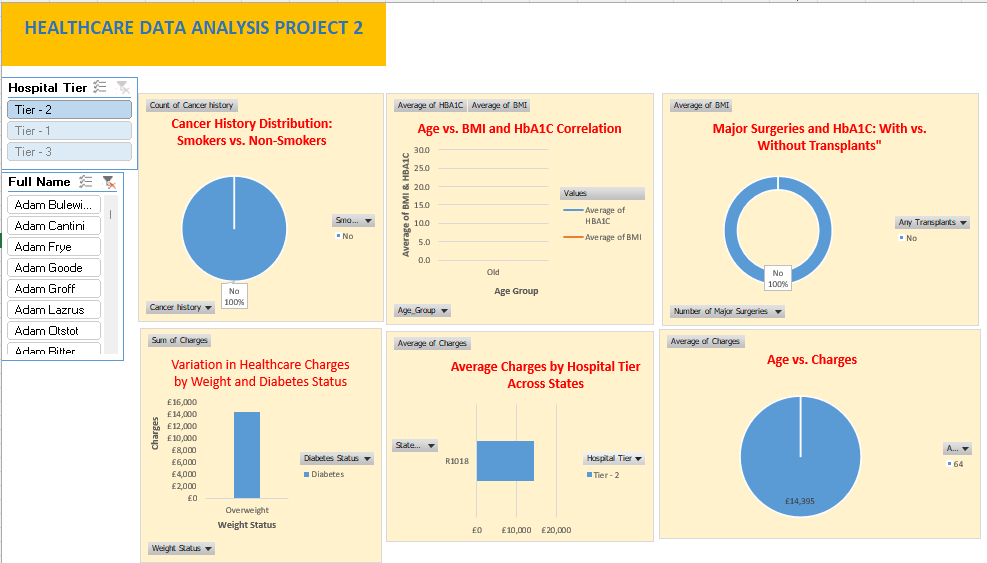

# healthcare-data-analysis
Exploratory data analysis on a healthcare dataset using Excel
# 🏥 Healthcare Data Analysis Project – Excel Based

## 📌 Objective
This project involved analyzing a multi-sheet healthcare dataset to uncover insights related to patient health, lifestyle factors, hospital charges, and medical outcomes. Using Microsoft Excel, I cleaned, merged, and analyzed the data to identify key patterns that can support healthcare decision-making.

---

## 📁 Project Overview
- **Tools Used**: Microsoft Excel
- **Data Sheets Included**:
  - Customer Demographics
  - Medical Examination Records
  - Hospitalization Details

After merging all three sheets into a single master dataset, I used Excel techniques such as formulas, PivotTables, charts, and dashboards to extract insights and visualize trends.

---

## 🧹 Data Cleaning & Preparation
- Removed duplicates and checked for missing values
- Created calculated fields (e.g., BMI classification)
- Used formulas and conditional formatting to categorize patients:
  - **BMI**: Underweight, Healthy, Overweight, Obese
  - **Blood Sugar**: Normal, Pre-Diabetic, Diabetic
- Merged all sheets using customer ID to build a **Master Dataset**

---

## 🔍 Key Insights

### 📌 Lifestyle & Health Trends
- **Cancer History**: 391 patients had a history of cancer
- **Obesity & Heart Issues**: 490 obese patients also had heart-related problems
- **Diabetes**: 784 customers were diabetic
- **Smokers’ HBA1C Levels**: Average HBA1C among smokers was **6.61**
- **Transplants**: 6% of patients had undergone a transplant

### 📌 Hospitalization Analysis
- **Highest BMI**: Jean Dufeal
- **Total Major Surgeries**: 1,579
- **Patients with >2 Surgeries**: Avg. BMI was **32.98**
- **Charges by Age**: Customers over 50 had an average charge of **£17,856.79**
- **Charges by Children**: People with more than 2 children were charged **£14,217.52** on average

### 📌 Hospital Tier Comparison
| Tier | Total Charges | Avg. Charges |
|------|----------------|--------------|
| Tier 1 | £9,159,276 | £13,051.35 |
| Tier 2 | £15,875,729.61 | £13,445.53 |
| Tier 3 | £6,557,352.63 | £14,057.09 |

- **Tier 2 hospitals** had the highest total charges
- **Tier 3 hospitals** had the highest **average charge per customer**

---

## 📊 Dashboard & Visualizations
Created an interactive Excel dashboard using:
- **PivotTables & Slicers** for dynamic filtering
- **Donut Charts** for comparing lifestyle factors and disease history
- **Column Charts** for tier-wise hospital cost analysis
- **Line Charts** showing trends by age (e.g., BMI, blood sugar, hospital charges)

---

## 🧠 Learnings & Takeaways
- Merging and analyzing multiple datasets taught me how to manage and transform complex healthcare data.
- Data segmentation helped uncover lifestyle-health correlations (e.g., obesity, cancer, and charges).
- Visualization improved the communication of findings to non-technical audiences.
- Reinforced Excel techniques like PivotTables, charts, logical functions, and data cleaning best practices.

---

## 📎 Dataset Source
- Dataset originally sourced from [Author’s GitHub Repository](https://github.com/vignesh4005/Healthcare_Data_Analysis)
Used for educational and non-commercial purposes only.

---

## 📫 Contact
- **[Chioma Nnadi]**
- 📧 [Email](nnadicvictoria@gmail.com)
- 🔗 [Linkedin](https://www.linkedin.com/in/nnadichioma/)
